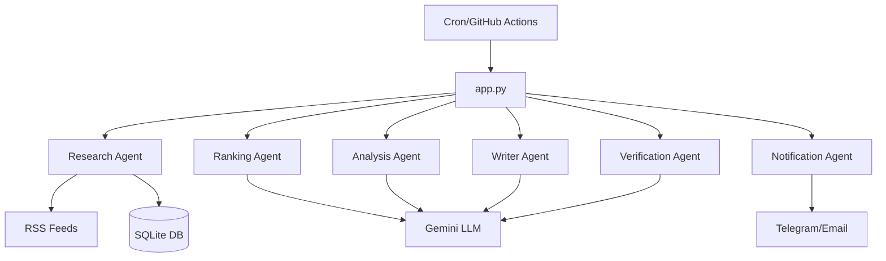

# AI-Powered LinkedIn Research Agent

An autonomous AI agent built in Python that researches the latest AI & technology news, analyzes the information, and generates a professional, human-like LinkedIn post. The post is fact-checked and sent for manual approval via Telegram or Email.

## Project Overview

This project is a production-ready, scalable AI pipeline demonstrating multi-agent workflows using Google's Gemini LLM. It focuses on high-quality content curation, preventing duplicate topics (30-day memory rule), and providing a clean, modular architecture.

### Features
- **RSS Ingestion:** Fetches news from top AI sources (OpenAI, Google, TechCrunch, etc.).
- **Duplicate Detection:** Uses an SQLite database to ensure the same topic isn't posted twice within 30 days.
- **AI Ranking:** Ranks news based on Innovation, Enterprise Relevance, and Trend Score.
- **AI Analysis:** Extracts key takeaways, business impact, and technical summaries.
- **AI Writer:** Drafts a compelling, educational, and professional LinkedIn post without AI clichés.
- **Fact-Checking Verification:** Flags potential hallucinations or low-confidence statistics.
- **Notifications:** Delivers the draft to Telegram or Email for manual review.

## Architecture



## Installation

1. **Clone the repository:**
   ```bash
   git clone <repo-url>
   cd linkedin-ai-agent
   ```

2. **Create a virtual environment:**
   ```bash
   python -m venv venv
   source venv/bin/activate  # On Windows: venv\Scripts\activate
   ```

3. **Install dependencies:**
   ```bash
   pip install -r requirements.txt
   ```

## Configuration

1. Copy `.env.example` to `.env`:
   ```bash
   cp .env.example .env
   ```

2. Fill in your environment variables:
   - `GEMINI_API_KEY`: Get this from Google AI Studio.
   - `TELEGRAM_BOT_TOKEN` & `TELEGRAM_CHAT_ID`: Follow the Telegram setup below.
   - (Optional) SMTP details if you prefer email.

## Telegram Setup

1. Message `@BotFather` on Telegram and use `/newbot` to create a bot.
2. Copy the given HTTP API Token to `TELEGRAM_BOT_TOKEN`.
3. Message your new bot to start a conversation.
4. Visit `https://api.telegram.org/bot<YOUR_TOKEN>/getUpdates` in your browser.
5. Find the `"chat": {"id": 123456789}` in the JSON response and copy the ID to `TELEGRAM_CHAT_ID`.

## Running Locally

Run the main orchestrator script:
```bash
python app.py
```
Check the `output/latest_post.md` file or your Telegram for the result!

## GitHub Actions Setup

This agent runs automatically every 6 hours using GitHub Actions.
1. Push your code to GitHub.
2. Go to your repository settings -> Secrets and variables -> Actions.
3. Add your environment variables (`GEMINI_API_KEY`, `TELEGRAM_BOT_TOKEN`, `TELEGRAM_CHAT_ID`) as Repository Secrets.

## Future Enhancements
- Support for Groq/OpenAI models by extending the `LLMBaseAgent`.
- Scraping company blogs or arXiv directly using web scraping tools.
- Multi-language support for LinkedIn posts.
